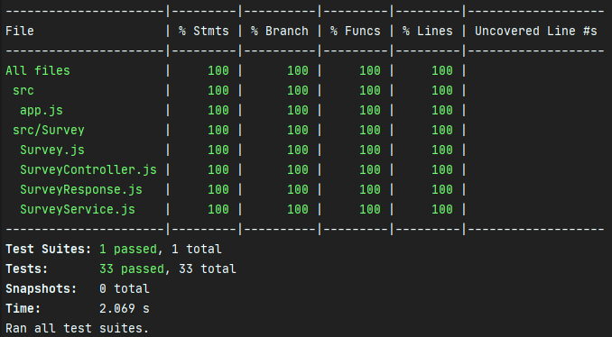
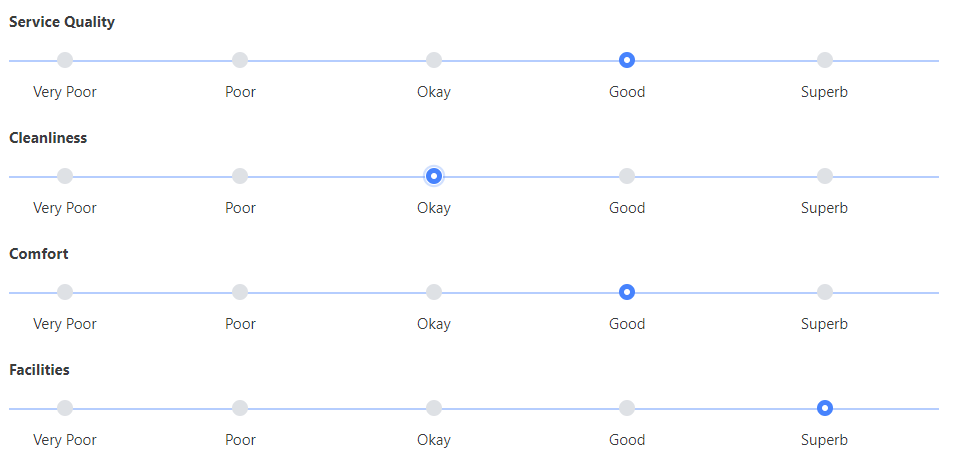

# sqa-final
Final assignment of the SQA module

## Get started

### Install dependencies
The project is written in nodejs and uses npm as package manager. See
   * https://nodejs.org/
   * https://npmjs.com
   
#### Installation
Install project dependencies
```shell
npm install
```

### Run the application

#### Start
Launch the application on port 3000
```shell script
npm start
```

#### Dev
Launch the application on port 3000
```shell script
npm run dev
```
The application will reload each time a change is made to the code

### Tests and code coverage
Running tests and code coverage
```shell script
npm run test
```


### API
See api documentation [here](./API.md).

## Code review 

See code review documentation [here](CODE_REVIEW.md)

## Git flow

See git flow documentation [here](GITFLOW.md)

## TESTS 

See tests documentation [here](TESTS.md)

## Project backlog

See project backlog [here](SPRINT_BACKLOG.md)

## Topic
As part of a Software Quality management plan for an organisation you have been asked to implement an example software project. This will be a reference guide for best practices that the rest of the team can refer to. The project will demonstrate the following topics:
* Scrum sprint backlog and task estimation
* Unit testing and Test-Driven development
* Test coverage metric
* Team version-control 
* Code-review checklist

### Description
You are going to create a software component in Java for storing information about Surveys and Responses. Each Survey is made up of multiple Questions (up to a maximum of 10). Every SurveyResponse should contain an answer to each Question in its Survey, where the answer will be an integer value between 1 and 5 (i.e. representing a Likert scale).

Here's an example to help you visualise the problem: 

Note:
This component does not have a user interface or a connection to any external storage (e.g. a Database). Your solution should contain one "controller" class with methods that support the features outlined below. For example the controller should have a method that creates a new Survey. You may also need to create additional classes that the controller uses e.g. a Survey.
### Features
Your software component should allow a caller (another piece of code that calls one of its methods) to create a new Survey, add a question to a survey, get a list of all surveys, get a specific survey by name. It should also support creating a new SurveyResponse, adding an answer to a SurveyResponse, and getting all SurveyResponses associated with a specific Survey.
Finally it should provide summary calculations including the average, standard deviation,  minimum and maximum score for a Survey and the average, standard deviation, minimum and maximum score for a specific question on a Survey.
 
### Platform
You will add your software component, as well as supporting documentation in a README file, to a repository on Github. Documentation should use the MarkDown format that you used in your first assignment.

### Scrum sprint backlog and task estimation
Before writing any code create a prioritised Sprint backlog of tasks in your documentation, with estimates for each task. In addition add a paragraph that describes how you chose these estimates, comparing the difficulty of two tasks with different estimates. Finally, explain how the Velocity metric is calculated at the end of each sprint, and how that feeds into planning for the next Sprint.

### Unit testing and Test-Driven development
Follow a Test-Driven development approach to write the code. Each commit to your repository should ideally include a test or tests and the associated code that supports those tests. In your documentation add a section on test-driven development that describes the approach by linking to a specific commit and explaining the contents. 

### Test coverage metric
In order to verify that sufficient unit testing takes place you will investigate and choose a code coverage tool. Add a section to the documentation that describes how to run the tool and include a screenshot of the tool running on your project.

### Team version-control 
Follow the GitFlow process for your project. In your documentation include a section on Team version control, that describes the branches that were created for your project and how they fit in GitFlow. 

### Code-review checklist
In this project you will review and accept your own Pull Requests, however you should also include a section in your documentation on Code Reviews. Suggest a checklist of things that a reviewer should check when reviewing a Pull Request. Link to a closed Pull Request within your project that demonstrates this list was followed (e.g. by leaving a comment on the Pull Request).

### Submission
Submit a link to your Github repository through Brightspace
