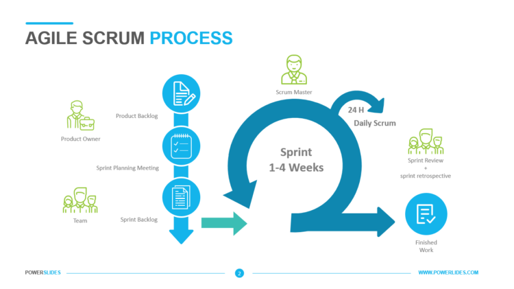

# Sprint Backlog

## Scrum backlog

| Task                                                           	| Owner   	| Estimation    |
|----------------------------------------------------------------	|---------	|------------   |
| Create API server                                                	| Bastien 	| 2             |
| Create Survey entities                                           	| Bastien 	| 1             |
| Create Survey controller                                         	| Bastien 	| 1             |
| Create GET endpoint to get all surveys                        	| Bastien 	| 1          	|
| Create GET endpoint to retrieve a Survey                         	| Bastien 	| 1          	|
| Create POST endpoint to create a Survey                         	| Bastien 	| 1          	|
| Create DELETE endpoint to delete a Survey                      	| Bastien 	| 1          	|
| Create POST endpoint to add a question into a Survey             	| Bastien 	| 1          	|
| Create POST endpoint to add a SurveyResponse into a Survey       	| Bastien 	| 1          	|
| Create POST endpoint to add a response into a SurveyResponse     	| Bastien 	| 1          	|
| Create GET endpoint to get metrics on a Survey                  	| Bastien 	| 1          	|
| Create GET endpoint to get metrics on a Survey question         	| Bastien 	| 1          	|
| Unit test for 100% coverage                                   	| Bastien 	| 2          	|
| Make documentation                                             	| Bastien 	| 2          	|

## Task estimation

This backlog represents all the tasks to be carried out for this project, as well as the estimated working time and difficulty associated with each task.
These estimates are made on the basis of past knowledge and experience on similar projects.
Similar tasks, adjusted according to the scope of the task, are given a similar estimate.
Velocity is calculated by adding the estimated tasks completed during the sprint. This value is then used to regulate the volume of work for the next sprint, adjusted with the feedback from the sprint end meeting.
