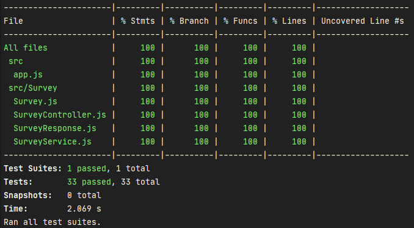

# TESTS

All tests must be validated in order to validate a merge application.

These tests must cover the entire code (code coverage of 100%).

See
* jest documentation [here](https://jestjs.io/)
* superagent documentation [here](https://visionmedia.github.io/superagent/)
* supertest documentation [here](https://github.com/visionmedia/supertest)

